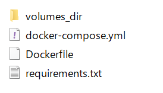

# dockerの備忘録
dockerの基本的な使い方参考のまとめ。

docker desktopは有償化したのでdocker engineを使用した方がいい。

docker engineはWindowsの場合、WSL上で使う。
## dockerでpython環境つくるためのTips
### 参考サイト
DockerでPython実行環境を作ってみる
<br>
https://qiita.com/jhorikawa_err/items/fb9c03c0982c29c5b6d5
<br>
<br>
docker-composeでvolumesを設定する
<br>
https://zenn.dev/ajapa/articles/1369a3c0e8085d
<br>
<br>
Docker Image Python
<br>
https://hub.docker.com/_/python
<br>
<br>
Linux 用 Windows サブシステムで Visual Studio Code の使用を開始する
<br>
https://docs.microsoft.com/ja-jp/windows/wsl/tutorials/wsl-vscode
<br>
<br>
DockerとDocker ComposeでPythonの実行環境を作成する
<br>
https://zuma-lab.com/posts/docker-python-settings
<br>
<br>
Dockerfileで日本語ロケールを設定する方法。およびロケールエラーの回避方法。
<br>
https://qiita.com/YuukiMiyoshi/items/f389ea366060537b5cd9
<br>
<br>
WSL2でLinux～Windows間のファイルのやり取り
<br>
https://bootcamp.fjord.jp/articles/29
<br>
<br>
Dockerコンテナの作成、起動〜停止まで
<br>
https://qiita.com/kooohei/items/0e788a2ce8c30f9dba53
<br>
<br>
Dockerイメージとコンテナの削除方法
<br>
https://qiita.com/tifa2chan/items/e9aa408244687a63a0ae
<br>
<br>
docker,docker-compose設定でデフォルト作業用ディレクトリを設定
<br>
https://webplus8.com/dockerfile-docker-compose-yml-working-directory/
<br>
<br>
docker-compose.ymlの書き方について解説してみた
<br>
https://qiita.com/yuta-ushijima/items/d3d98177e1b28f736f04
<br>
<br>
コンテナに入りたい？それ docker exec でできるよ
<br>
https://qiita.com/yosisa/items/a5670e4da3ff22e9411a
<br>
<br>
DockerでJupyterLab環境を作る
<br>
https://qiita.com/plumfield56/items/335cad3b58afe55f6529
<br>
<br>
dockerで立ち上げたアプリケーションにアクセスできない
<br>
https://qiita.com/yukofeb/items/0e6c60f3dd54ae589b41
<br>
<br>
Docker上でJupyter Notebookを使用しようとしてハマったときの対処
<br>
https://qiita.com/watyanabe164/items/64b8be31cd1c7c7940d3
<br>
<br>
Dockerでlocalhostが立たない！そんな時はここをみて！
<br>
https://qiita.com/wangqijiangjun/items/54a949cd140b61dc7763
<br>
<br>
docker上でjupyter-notebookを使用する方法
<br>
https://qiita.com/ricrowl/items/bc178a184a300b22e5e5
<br>
<br>
Dockerコンテナの内部IPアドレスを確認する方法
<br>
https://qiita.com/ponsuke0531/items/7e8e5081993a30afdc4a
<br>
<br>
jupyter labをリモートから使う
<br>
https://qiita.com/RayDoe/items/e1ec21c63a15adb1a061
<br>
<br>
Vimでクリップボードからのペーストを可能にする
<br>
https://sy-base.com/myrobotics/vim/vim_use_clipboard/
<br>
<br>
vimでクリップボード連携を有効にした話
<br>
https://pocke.hatenablog.com/entry/2014/10/26/145646
<br>
<br>
.vimrc に変更を加えた場合 Vim の再起動をせずに source ~/.vimrc で再読込みすることができる
<br>
http://weble.org/2011/01/21/vim-source-vimrc
<br>
<br>
コンテナ上でのパッケージ更新と保存方法
<br>
https://www.hobby-happymylife.com/setup/docker_package_save/
<br>
<br>
(miniconda入れる場合)miniconda+conda-forgeでの開発環境をDockerでそろえる
<br>
https://qiita.com/kimisyo/items/66db9c9db94751b8572b
<br>
(miniconda入れる場合)Dockerfileでconda activateする方法
<br>
https://note.yu9824.com/howto/2021/09/04/docker-conda-activate.html
<br>
<br>
日本語フォント入れる
<br>
```apt-get install -y fonts-ipaexfont```
<br>
<br>
## コマンド
#docker imageの検索
<br>
sudo docker search centos
<br>
<br>
dockerデーモンステータス確認
<br>
sudo service docker status
<br>
<br>
dockerデーモン起動
<br>
sudo service docker start
<br>
<br>
イメージを一覧表示
<br>
sudo docker images
<br>
<br>
イメージの一覧を出力
<br>
sudo docker image ls
<br>
<br>
コンテナーを一覧表示
<br>
sudo docker container ls
<br>
<br>
レジストリからイメージやリポジトリを取得
<br>
sudo docker pull centos:7
<br>
<br>
コンテナを一覧表示
<br>
sudo docker ps
<br>
<br>
コンテナのプロセスを他のプロセスツリーからは隔離（分離）して実行
<br>
コンテナのプロセスに対してttyを割り当てるために、よく -i -t は -it と書かれる
<br>
sudo docker run -it centos
<br>
<br>
自分のターミナルの標準入力、標準出力、標準エラーにアタッチする
<br>
コマンドを自分のターミナル上で直接実行しているかのように、インタラクティブ（双方向）に制御できる
<br>
sudo docker attach <id>
<br>
<br>
1つまたは複数のコンテナを削除
<br>
sudo docker rm <id>
<br>
<br>
docker-compose：yaml形式の設定ファイルで複数コンテナを実行を一括で管理できる
<br>
コンテナを作成し、開始
<br>
up,downでサービスの起動停止
<br>
バックグラウンド実行なら「-d」を付けてup
<br>
docker compose up --build：サービスの構築もしくは再構築
<br>
sudo docker compose up -d --build
<br>
<br>
1つまたは複数のイメージを削除
<br>
sudo docker rmi <id>
<br>
<br>
停止しているdockerコンテナを起動
<br>
-i, --interactive：インタラクティブモードとなるため、継続してコマンド操作などが可能
<br>
sudo docker start <id>
<br>
<br>
1つまたは複数の実行中コンテナを停止
<br>
sudo docker stop <id>
<br>
<br>
実行中のコンテナ内でコマンドを実行
<br>
-it：標準入力を開き続ける＋疑似TTYを割り当て
<br>
bash：対話形式のbashシェルを起動してコマンドの入力を受け付ける状態
<br>
sudo docker exec -it <container-name> bash
<br>
<br>

Dockerfile

```Dockerfile
FROM python:3.10
USER root

RUN apt update
RUN apt -y install locales && \
    localedef -f UTF-8 -i ja_JP ja_JP.UTF-8

ENV LANG ja_JP.UTF-8
ENV LANGUAGE ja_JP:ja
ENV LC_ALL ja_JP.UTF-8
ENV TZ JST-9
ENV TERM xterm

RUN apt install -y sudo
RUN apt install -y vim less
#RUN apt install -y --no-install-recommends graphviz
RUN apt install -y graphviz graphviz-dev
RUN apt install -y fonts-ipaexfont
# vim install and config
RUN apt install -y vim-gtk3
RUN touch ~/.vimrc
RUN echo 'set clipboard&' >> ~/.vimrc
RUN echo 'set clipboard^=unnamedplus' >> ~/.vimrc
RUN ["/bin/bash", "-c", "source ~/.vimrc"]

# for pymc
RUN apt install libblas-dev -y
# for mecab
RUN apt install mecab -y
RUN apt install libmecab-dev -y
RUN apt install mecab-ipadic-utf8 -y
RUN git clone --depth 1 https://github.com/neologd/mecab-ipadic-neologd.git
RUN mecab-ipadic-neologd/bin/install-mecab-ipadic-neologd -n -y
RUN mv /usr/lib/x86_64-linux-gnu/mecab/dic/mecab-ipadic-neologd /var/lib/mecab/dic
RUN mv /etc/mecabrc /etc/mecabrc_old
RUN echo 'dicdir = /var/lib/mecab/dic/mecab-ipadic-neologd' >> /etc/mecabrc
RUN cp /etc/mecabrc /usr/local/etc/

RUN mkdir -p /root/work
COPY requirements.txt /root/work
WORKDIR /root/work

RUN pip install --upgrade pip
RUN pip install --upgrade setuptools
RUN pip install -r requirements.txt
# jupyter config
RUN jupyter lab --generate-config
RUN echo "c.NotebookApp.ip = '0.0.0.0'" >> /root/.jupyter/jupyter_lab_config.py
RUN echo "c.NotebookApp.port = 8888" >> /root/.jupyter/jupyter_lab_config.py
RUN echo "c.NotebookApp.token = ''" >> /root/.jupyter/jupyter_lab_config.py
RUN echo "c.NotebookApp.allow_root = True" >> /root/.jupyter/jupyter_lab_config.py
RUN echo "c.NotebookApp.open_browser = False" >> /root/.jupyter/jupyter_lab_config.py
```

<br>
<br>
docker-compose.yml

```
version: '3.10'
services:
  python3-10:
    restart: always
    build: .
    container_name: 'venv'
    working_dir: /root/
    tty: true
    volumes:
      - ./work:/root/work
    ports:
      - "8888:8888"
```

Dockerfikeやdocker-compose.ymlを置いている場所にrequirements.txtなども置いておく。




# Rインストールするとき
`sudo apt update`  
`sudo apt install -y r-base r-base-dev`  
`sudo apt install -y r-base-dev`  
`sudo apt install -y libharfbuzz-dev libfribidi-dev`  
`sudo apt install -y libv8-dev`  
`sudo apt install -y libudunits2-dev`  
`sudo apt install -y libgdal-dev`  
`sudo apt install -y libjq-dev`  
`sudo apt install -y libprotobuf-dev`  
`sudo apt install -y protobuf-compiler`  
`sudo apt install -y r-cran-gsl`  
`sudo apt install -y libgsl-dev`  
[Rのtidyverse パッケージのインストールでつまったので解決法をメモ](https://zenn.dev/kreutzer000/articles/87f6639e50d06b)  
[Rstudioでrayshaderを表示するまでにやったこと](https://qiita.com/m37335/items/d7a31aaa2e2cdf7ba277)  
[DockerでPythonにてGDALを利用する](https://zenn.dev/straydog/articles/a5c005cc7cfe22)  

```r
install.packages("tidyverse")
install.packages("NipponMap")
install.packages("sf")
install.packages('raster')
install.packages("here")
install.packages("jpmesh")
install.packages("devtools")
install.packages("rmapshaper")
install.packages("geojsonio")
devtools::install_github("uribo/jpndistrict")
install.packages("CARBayes")

library(sf)
library(NipponMap)
library(RColorBrewer)
library(raster)
library(tidyverse)
library(jpmesh)
library(rmapshaper)
library(geojsonsf)
library(CARBayes)
```