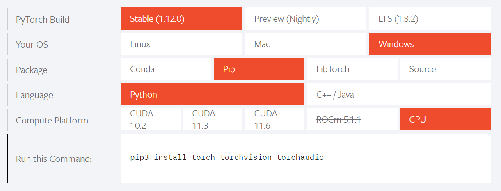

# pytorch, transformersのインストール備忘録

" https://pytorch.org/ "で、自分の環境にあったインストール方法がわかる。



また、日本語でtransformersを使う場合、fugashiやipadicが必要。

なので、pytorch, transformersをインストールするときは以下を実行。

```python
pip install torch torchvision torchaudio
pip install transformers
pip install fugashi
pip install ipadic
```