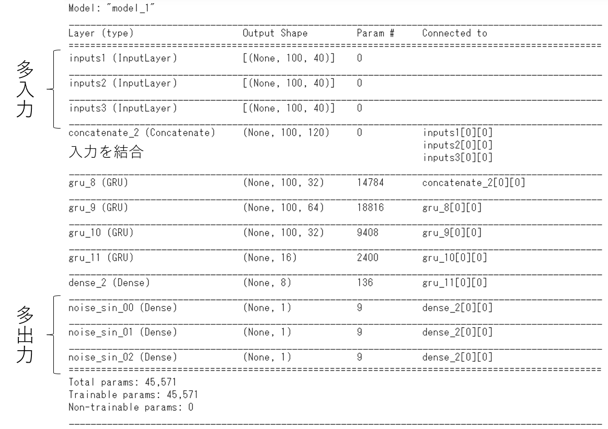

# kerasのfunction APIで多入力多出力モデル作る備忘録
例えば、説明変数40個、目的変数3個でモデルを作るとする。

入力層を複数用意して、tensorflow.keras.layers.concatenateで結合する。

そのままネットワークを組んで、出力層も目的変数の数の文だけ作る。

学習時は入出力層の名前とデータを辞書にまとめて与える。

Validationデータは入出力層の名前はいらず、データをリストにまとめて与える。

```python
from tensorflow.keras.models import Model
from tensorflow.keras.layers import Input, Dense, GRU, Embedding, Activation, concatenate
from tensorflow.keras.callbacks import EarlyStopping, ModelCheckpoint

# timeseries predoction X_train.shape: ex. (4699, 100, 40)
# timeseries predoction y_train.shape: ex. (4699, 1, 3)
# Input(shape=((列数（シーケンスの長さ）,次元（データの数）)))

# 入力層を複数用意
inputs1 = Input(shape=((X_train.shape[1], X_train.shape[2])), name="inputs1")
inputs2 = Input(shape=((X_train.shape[1], X_train.shape[2])), name="inputs2")
inputs3 = Input(shape=((X_train.shape[1], X_train.shape[2])), name="inputs3")
# 複数用意した入力層を結合
inputs = concatenate([inputs1, inputs2, inputs3])
n_layer=3
num_out1=[32,64,32]
num_out2=16
num_out3=8
activation='relu'
optimizer='adam'
batch_size=64
epochs=200
my_loss='mean_squared_error'

# 多層GRUネットワーク
for i in range(0, n_layer):
    if i == 0:
        embed = GRU(num_out1[i], return_sequences=True, recurrent_dropout=0.05)(inputs)
    else:
        embed = GRU(num_out1[i], return_sequences=True)(embed)

embed = GRU(num_out2, return_sequences=False)(embed)

hiddened = Dense(num_out3, activation=activation)(embed)
# 出力層を複数用意 list型
outputs=[Dense(1, name=col)(hiddened) for col in names]  # names:list; ex.['col1', 'col2', 'col3']
model = Model(inputs=[inputs1, inputs2, inputs3], outputs=outputs)   # 入出力層はlist型
model.summary()
model.compile(loss=my_loss, optimizer=optimizer)

model_path='model_dir/model.hdf5'
call_backs=[EarlyStopping(patience=20), ModelCheckpoint(model_path, save_best_only=True)]
# Trainデータは{name:data}の辞書型、Validationデータは[data]のリスト型で与える
outputs_data={col:y_train[:,0,i] for i, col in enumerate(names)}  # dict
outputs_data_val=[y_valid[:,0,i] for i, col in enumerate(names)]  # list
history = model.fit({'inputs1': X_train, 'inputs2': X_train, 'inputs3': X_train}  # dict
                    , outputs_data  # dict
                    , batch_size=batch_size, epochs=epochs
                    , callbacks=call_backs
                    , validation_data=([X_valid, X_valid, X_valid], outputs_data_val)  # list
                    , shuffle=False)  # starts training
```

model.summary()

