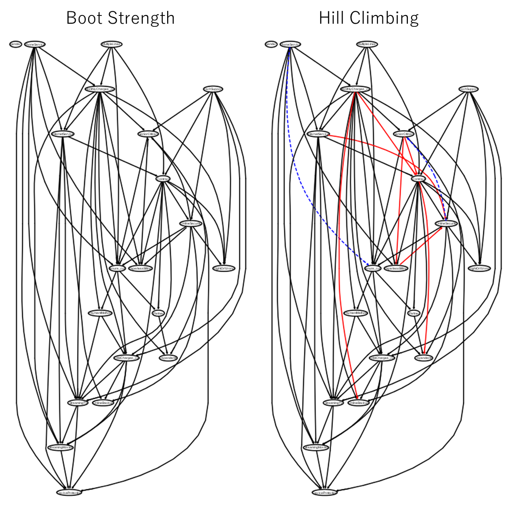

# Rでデータハンドリング & ベイジアンネットワーク備忘録

データ読み込み。
```r
library(DiagrammeR)
library(bnlearn)
library(data.table)
library(Matrix)
library(Rgraphviz)
library(ggplot2)
library(dplyr)
library(tidyverse)

# Kaggleのデータセットにオリジナルの'RightOrWrong'列を与えている
datacsv=read.table('TelcoCustomerChurn.addRightOrWrong.csv',sep=',',header=TRUE)
colnames(datacsv)
datacsv
```


最初の列は使わない。

数値の列の最大値最小値を確認。

数値の列をビニングして新しい列として追加。
```r
data=datacsv[,2:21]  # Rは1スタート data.loc[:,1:20]
colnames(data)  # data.columns

data %>% dplyr::summarise(max=max(tenure), min=min(tenure))  # data[['tenure']].agg(['min', 'max'])
data %>% dplyr::summarise(max=max(MonthlyCharges), min=min(MonthlyCharges))  # data[['MonthlyCharges']].agg(['min', 'max'])
data %>% dplyr::summarise(max=max(TotalCharges), min=min(TotalCharges))  # data[['TotalCharges']].agg(['min', 'max'])

data = data %>% dplyr::mutate(tenure_cut = cut(datacsv[,'tenure'], breaks = c(0, 10, 20, 30, 40, 50, 60, 70, 80), right = FALSE))  # pd.cut(data['tenure'], bins=[0, 10, 20, 30, 40, 50, 60, 70, 80])
data = data %>% dplyr::mutate(MonthlyCharges_cut = cut(datacsv[,'MonthlyCharges'], breaks = c(0, 20, 40, 60, 80, 100, 120), right = FALSE))  # pd.cut(data['MonthlyCharges'], bins=[0, 20, 40, 60, 80, 100, 120])
data = data %>% dplyr::mutate(TotalCharges_cut = cut(datacsv[,'TotalCharges'], breaks = c(0, 1000, 2000, 3000, 4000, 5000, 6000, 7000, 8000, 9000), right = FALSE))  # pd.cut(data['TotalCharges'], bins=[0, 1000, 2000, 3000, 4000, 5000, 6000, 7000, 8000, 9000])
data
```


もともとの数値の列除外。

ビニングの列をラベルエンコード。

```r
data2 = select(data, -tenure)  # data.drop(columns=['tenure'])
data2 = select(data2, -MonthlyCharges)  # data.drop(columns=['MonthlyCharges'])
data2 = select(data2, -TotalCharges)  # data.drop(columns=['TotalCharges'])

tibble::glimpse(data2)  # data.info() & data.to_numpy()

data2 = data2 %>% drop_na()  # data.dropna()
data2 = sapply(data2, as.numeric)  # Labelencoder()
data2 = data.table(data2)

tibble::glimpse(data2)  # data.info() & data.to_numpy()
```


'RightOrWrong'を除いたカラム名取得。

因果のブラックリスト登録。('RightOrWrong'を目的変数と想定)
```r
data2_colnames=c(colnames(data2))  # data.columns
data2_colnames=data2_colnames['RightOrWrong' != data2_colnames]
data2_colnames

bl = tiers2blacklist(list(data2_colnames, "RightOrWrong"))
bl2 = tiers2blacklist(list("InternetService",c('OnlineSecurity','OnlineBackup','DeviceProtection','TechSupport','StreamingTV','StreamingMovies')))
bl = rbind(bl, bl2)  # list + list or pd.concat
bl
```


Hill Climbing法で構造学習。各変数間のつながりを確認。（変数が正規分布などの仮定を置いている前提）
```r
net.estimated=hc(data2, score = "bic-g", blacklist = bl)  # Hill Climbing (HC)
class(net.estimated)
graphviz.plot(net.estimated, layout = "dot", shape = "rectangle")
```


ブートストラップ法(boot.strength)で構造学習。各変数間のつながりの強さと因果の向きを確認。

strengthの累積分布関数と有意な水準となる閾値を確認。
```r
str.X_train = boot.strength(data2, R = 199, algorithm = "hc",   # R:a positive integer, the number of bootstrap replicates.
                            algorithm.args = list(score="bic-g",blacklist=bl))  #
head(str.X_train)
attr(str.X_train, "threshold")
plot(str.X_train)
```


Hill Climbing法とブートストラップ法の比較など。
```r
avg.X_train = averaged.network(str.X_train)
strength.plot(avg.X_train, str.X_train, shape = "ellipse")
graphviz.plot(avg.X_train, layout = "dot", shape = "rectangle")
par(mfrow = c(1,2))  # plt.subplot(1,2,i)
graphviz.compare(avg.X_train, net.estimated, shape = "ellipse", main = c("Boot Strength", "Hill Climbing"))  # 赤線が右のグラフのみにある円弧を、青線が左のグラフにのみある円弧
```


