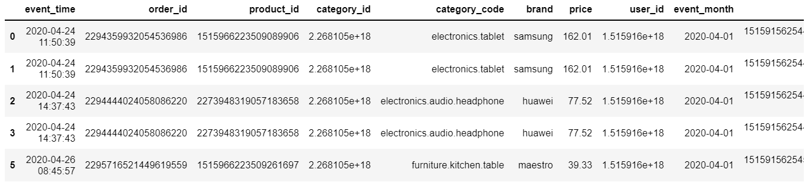
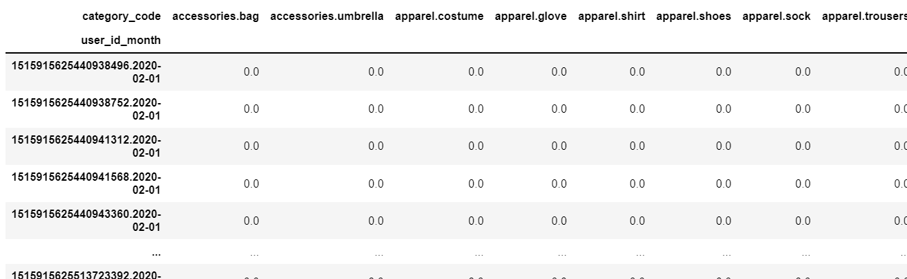
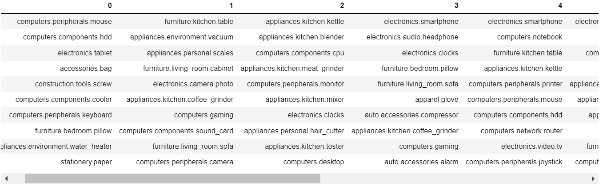
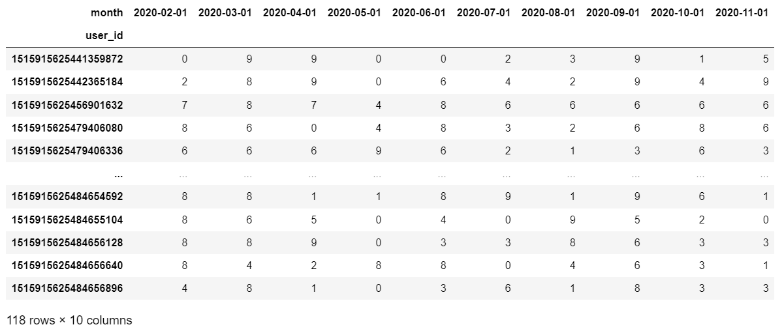
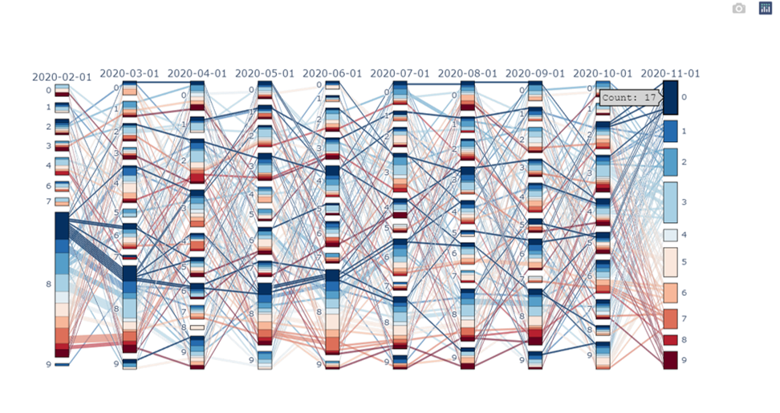

# サンキーダイヤグラム作成備忘録
昔作ったことあるけど、昔よりもっと簡単に作れるようにplotlyが進化していた。

参考：

https://oeconomicus.jp/2021/07/plotly-color-scale/

https://plotly.com/python/parallel-categories-diagram/

ユーザーを月ごとのデータでクラスタリングして、月ごとにクラスタの遷移がどうなっているかサンキーで可視化というお題でお試し。

データ加工してクラスタリング。

```python
import pandas as pd
import matplotlib.pyplot as plt
import numpy as np
import datetime as dt
import plotly.graph_objects as go
import plotly.express as px
import plotly.offline as offline
from sklearn.decomposition import LatentDirichletAllocation

# kaggleの「eCommerce purchase history from electronics store」データ(出典:https://rees46.com/)
df = pd.read_csv('kz.csv')
df = df.dropna()
df['event_time'] = pd.to_datetime(df['event_time'].str[:-4])
df = df[df['event_time']>=dt.datetime(2020,2,1)]
df['event_month'] = pd.to_datetime(df['event_time'].dt.date.astype(str).str[:-3])  # 月単位の情報
df['user_id_month'] = df['user_id'].astype(np.int64).astype(str)+'.'+df['event_month'].astype(str)  # user_idと月単位の情報くっつける
# 各ユーザーの月ごとの、category_code別購入回数のデータマート
dfpivo = df.pivot_table(index='user_id_month', columns='category_code', values='event_time', aggfunc=lambda x: len(x.unique())).fillna(0)
# Train, Testに分ける
dfpivo_train = dfpivo[pd.to_datetime(np.array([t[-1] for t in dfpivo.index.str.split('.')]))==dt.datetime(2020,2,1)].copy()
dfpivo_test = dfpivo[pd.to_datetime(np.array([t[-1] for t in dfpivo.index.str.split('.')]))>dt.datetime(2020,2,1)].copy()

# クラスタリング(LDA)
lda = LatentDirichletAllocation(n_components=10,random_state=0,
                                learning_method='batch',
                                max_iter=25)
lda.fit(dfpivo_train.to_numpy())

# 各トピックにおける、商品の出現確率上位20を取得する関数
def component(lda, features):
    df_component=pd.DataFrame()
    for tn in range(lda.components_.shape[0]):
        row = lda.components_[tn]
        words = [features[i] for i in row.argsort()[:-20-1:-1]]
        df_component[tn]=words
        words = ', '.join([features[i] for i in row.argsort()[:-20-1:-1]])
    return df_component

# 各トピックにおける、カテゴリの出現回数上位10まで抽出
features = dfpivo_train.columns.to_numpy()
df_component=component(lda, features)
display(df_component.iloc[:10,:])

# user_idごとの所属確率が最も高いトピックを列として追加したdfを作成
def create_topic_no(df_mart, lda, row='user_id'):
    df_id_cluster=df_mart.reset_index()[[row]].copy()
    df_topic=pd.DataFrame(lda.transform(df_mart.to_numpy()))
    topic=df_topic.loc[:,:].idxmax(axis=1).to_numpy()
    df_id_cluster['topic']=topic
    return df_id_cluster

# user_idとクラスタ番号のデータ作成
df_id_cluster_train=create_topic_no(dfpivo_train, lda, row='user_id_month')
df_id_cluster_test=create_topic_no(dfpivo_test, lda, row='user_id_month')
df_id_cluster = pd.concat([df_id_cluster_train, df_id_cluster_test]).reset_index(drop=True)

# index:user_id, columns:month, values:クラスタ番号のデータ作成
df_id_cluster['user_id'] = [t[0] for t in df_id_cluster['user_id_month'].str.split('.')]
df_id_cluster['month'] = [t[-1] for t in df_id_cluster['user_id_month'].str.split('.')]
dupUser = df_id_cluster.groupby(['user_id'])['month'].nunique()[df_id_cluster.groupby(['user_id'])['month'].nunique()>2].index
df_id_cluster = df_id_cluster[df_id_cluster['user_id'].isin(dupUser)]
df_id_cluster_pivo = df_id_cluster.pivot_table(index='user_id', columns='month', values='topic', aggfunc=np.max).dropna().astype(int)

df_n=df_id_cluster_pivo.copy()
df_n.head()
```
元データ。



各ユーザーの月ごとの、category_code別購入回数のデータマート。



各クラスタのカテゴリの出現回数上位10。



index:user_id, columns:month, values:クラスタ番号のデータ作成。これがサンキーダイヤグラムで可視化するデータ。

（注：すべての月にトランザクションがあるユーザーに絞ったので行数(ユーザー数)は118と少ない）


<br>
<br>
<br>
<br>
加工したデータをサンキーダイヤグラムで可視化。

```python
def sankey_plot(df_n, categoryorder='category ascending'
                , colorscale=px.colors.sequential.RdBu_r
                , save=True, show=True, filename='tmp'):
    # サンキー用にデータ加工
    dims = []
    for i, col in enumerate(df_n.columns):
        # Create dimensions
        dim = go.parcats.Dimension(values=df_n[col], categoryorder=categoryorder, label=col)
        dims.append(dim)
    #print(dims)  # カラン数分の長さのリスト
    
    # plot & save html
    color = df_n[col]  # 色の基準にするカラム（今回は2020-11-01）
    # sankey図の作成
    fig = go.Figure(data = [go.Parcats(dimensions=dims
                                       , line={'color': color, 'colorscale': colorscale} # 色の基準カラムと色指定
                                       #, hoveron='color', hoverinfo='count+probability'  # また今度調べる
                                       #, labelfont={'size': 18, 'family': 'Times'}  # ラベルのフォント
                                       #, tickfont={'size': 16, 'family': 'Times'}  # tickのフォント
                                       #, arrangement='freeform'  # また今度調べる
                                      )
                           ]
                   )

    if show:
        fig.show()  # 表示
    if save:
        offline.plot(fig, auto_open=False, filename=filename+'.html')  # html save
    return fig

fig = sankey_plot(df_n, categoryorder='category ascending'
                  , colorscale=px.colors.sequential.RdBu_r
                  , save=True, show=True, filename='tmp')
```


(2020年2月にクラスタ8にいた人は、2020年11月ではクラスタ0に遷移にした人が多い)