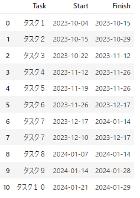
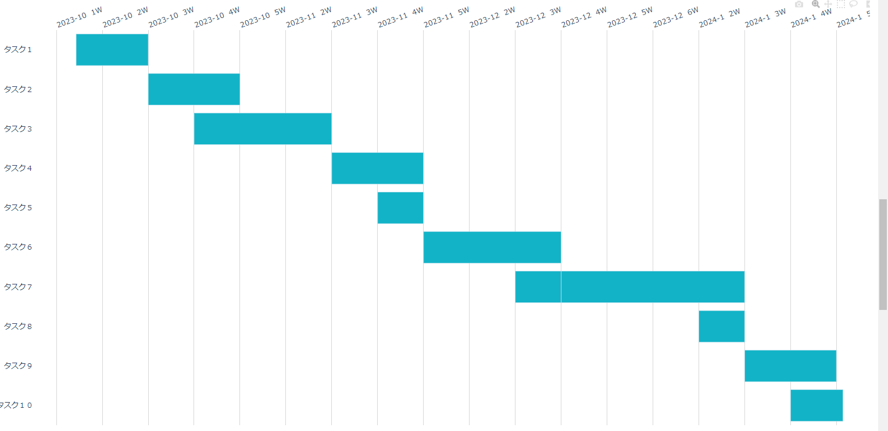

# 週単位のガントチャート作成コード
ざっくりスケジュール作成のための、週単位のガントチャートを作る。

参考：

https://plotly.com/python/gantt/

https://megatenpa.com/python/plotly/px/gantt-charts/

https://note.nkmk.me/python-calendar-datetime-nth-dow/


```python
import pandas as pd
import matplotlib as mpl
import seaborn as sns
import datetime as dt
import time
import calendar
from calendar import Calendar
import plotly.express as px
sns.set()

# ガントチャート用データフレーム作成
def make_dict(year_1, month_1, nweek1, span_week=1, start_offset=0, Task='task'):
    cl = Calendar(firstweekday=6)
    nweek_list = cl.monthdays2calendar(year_1, month_1)
    for nw, days_ in enumerate(nweek_list):
        for n_, d_ in enumerate(days_):
            if nw+1 == nweek1 and n_+1 == 1 and d_[0] > 0:
                start_day1 = dt.date(year_1, month_1, d_[0])#.strftime('%Y-%m-%d')
            elif nw+1 == nweek1 and n_+1 == 1 and d_[0] == 0:
                last_day = cl.monthdays2calendar(year_1, month_1-1)[-1][0][0]
                start_day1 = dt.date(year_1, month_1-1, last_day)#.strftime('%Y-%m-%d')
    end_day1 = start_day1 + dt.timedelta(weeks=span_week)
    start_day1 = start_day1 + dt.timedelta(weeks=start_offset)
    start_day1 = start_day1.strftime('%Y-%m-%d')
    end_day1 = end_day1.strftime('%Y-%m-%d')
    dict_ = dict(Task=Task, Start=start_day1, Finish=end_day1,)  # ジョブの名称 # 開始日 # 終了日
    return dict_

# 年と月、第何週から始まるか(nweek1)、期間は何週か(span_week)を引数とする
# start_offsetはnweek1をずらすためにある(そのままだと第n週の途中から設定できないため)
dict0 = make_dict(2023, 10, nweek1=2, span_week=1, start_offset=-0.5, Task='タスク１')
dict1 = make_dict(2023, 10, nweek1=3, span_week=2, start_offset=0, Task='タスク２')
dict2 = make_dict(2023, 10, nweek1=4, span_week=3, start_offset=0, Task='タスク３')
dict3 = make_dict(2023, 11, nweek1=3, span_week=2, start_offset=0, Task='タスク４')
dict4 = make_dict(2023, 11, nweek1=4, span_week=1, start_offset=0, Task='タスク５')
dict5 = make_dict(2023, 11, nweek1=5, span_week=3, start_offset=0, Task='タスク６')
dict6 = make_dict(2023, 12, nweek1=4, span_week=4, start_offset=0, Task='タスク７')
dict7 = make_dict(2023, 12, nweek1=3, span_week=1, start_offset=0, Task='タスク７')
dict7_2 = make_dict(2024, 1, nweek1=2, span_week=1, start_offset=0, Task='タスク８')
dict8 = make_dict(2024, 1, nweek1=3, span_week=2, start_offset=0, Task='タスク９')
dict9 = make_dict(2024, 1, nweek1=4, span_week=1.2, start_offset=0, Task='タスク１０')
df = pd.DataFrame([dict0, dict1, dict2, dict3, dict4, dict5, dict6, dict7, dict7_2, dict8, dict9])
display(df)
```



```python
# ある日時の第n週を取得
def get_nth_week(year, month, day, firstweekday=0):
    first_dow = calendar.monthrange(year, month)[0]
    offset = (first_dow - firstweekday) % 7
    return (day + offset - 1) // 7 + 1

# Plotlyのpxでガントチャートを作成
def gantt_chart(df, x_start='Start', x_end='Finish', y='Task'
                , save=False, fname='tmp.svg'
                , width=None, height=None, font_size=None, hoverlabel_font_size=None):
    dfadd=df.copy()
    dfadd['color'] = 'color'
    fig = px.timeline(
        dfadd,  # 使用するデータフレーム
        x_start=x_start, x_end=x_end,  # 横軸の開始・終了の列名
        y=y,  # 縦軸の列名
        color='color',
        color_discrete_map={'color': '#12B3C7'},
        width=width, height=height,
    )
    fig.update_yaxes(autorange="reversed")
    fig.update_xaxes(tickformat="%Y-%m-%d")
    # グラフ全体とホバーのフォントサイズ変更
    min_s = pd.to_datetime(df[x_start].min())
    max_e = pd.to_datetime(df[x_end].max())
    ticks_vals = pd.date_range(min_s + dt.timedelta(weeks=-1), max_e + dt.timedelta(weeks=1), freq='1W')
    ticktext = [(str(i.year)+'-'+str(i.month)+'  '+str(get_nth_week(i.year, i.month, i.day, firstweekday=6))+'W') for i in ticks_vals]
    fig.update_layout(font_size=font_size, hoverlabel_font_size=hoverlabel_font_size
                      , plot_bgcolor='white'
                      , xaxis_title=None, yaxis_title=None
                      , showlegend=False
                      , xaxis = dict(tickvals = ticks_vals.astype(str), ticktext = ticktext, tickangle = -20, side='top', gridcolor='lightgrey')
                      , yaxis=dict(side='left')
                     )
    if save:
        fig.write_image(fname)
    fig.show()

gantt_chart(df, x_start='Start', x_end='Finish', y='Task', save=True, fname='tmp.svg', font_size=14, width=1800, height=900)
```

