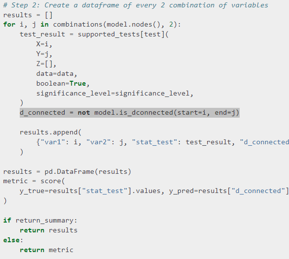
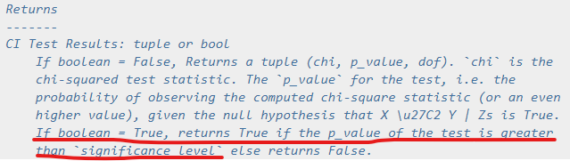

# pgmpyによるベイジアンネットワーク構築から評価、推論まで
```python
# 自分でDAGを考えて指定
my_dag = BayesianNetwork([('A','Y')
                          , ('B','Y')
                          , ('C','Y')
                          , ('A','C')
                         ]
                        )

# DAG可視化
plt.figure(figsize=(10, 5))
nx.draw_circular( my_dag, with_labels=True, font_family=prop.get_name(), alpha=0.5 )
plt.show()

# DAGをもとにCPD作成
my_dag.fit( df, estimator=BayesianEstimator, prior_type='BDeu' )


# CPD取得
cpd = my_dag.get_cpds()
display(cpd)
print('ノードYの条件付確率表shape', cpd[1].values.shape)

# ノードYの条件付確率表を取得
cpd_status = cpd[1].values
cpd_cols = cpd[1].variables
# ラベルのマスタにノードYのラベルも追加
le_list['Y'] = {0:'negative',1:'positive'}
print(le_list[cpd_cols[0]])
# le_listは{<カラム名>:{<エンコード値>:<ラベル>}}の辞書

# 目的変数の条件付確率が閾値以上の時の条件を取得する
def output_conditional_prob(cpd_status, cpd_cols, prob=0.5, target_status='positive'):
    # 条件と条件付確率を格納する辞書
    result_dic_1 = {}
    # 条件付確率表のShapeのリスト
    dim_arr = [[j for j in range(i)] for i in cpd_status.shape]
    cnt = 0
    # 全条件の組み合わせの確率を取得する
    for item in itertools.product(*dim_arr):
        # 目的変数がtarget_statusではないとき処理しない
        if le_list[cpd_cols[0]][item[0]]!=target_status:
            continue
        # ある1組の条件と条件付確率を格納する辞書
        result_dic = {}
        if cpd_status[item]>prob:
            print('----', cpd_cols[0], le_list[cpd_cols[0]][item[0]], '----')
            # 各変数と各変数の条件をresult_dicに格納
            for i, v in enumerate(item[1:]):
                print(cpd_cols[i+1], le_list[cpd_cols[i+1]][v])
                result_dic[cpd_cols[i+1]] = le_list[cpd_cols[i+1]][v]
            print('確率', round(cpd_status[item],3),'\n')
            # 条件付確率をresult_dicに格納
            result_dic['probability'] = (cpd_status[item])
            result_dic_1['Condition_'+str(cnt).zfill(3)] = result_dic
            cnt+=1
    return result_dic_1
    
# negative確率が0.8より高い条件
result_dic_0 = output_conditional_prob(cpd_status, cpd_cols, prob=0.8, target_status='negative')
# positive確率が0.8より高い条件
result_dic_1 = output_conditional_prob(cpd_status, cpd_cols, prob=0.5, target_status='positive')


# 推論
infer = VariableElimination(my_dag)


# 推論の実行
results = []
print(len(df))
for num, (index, row) in tqdm(enumerate(df.iterrows())):
    new_dict = {k: v for k, v in row.to_dict().items() if k != 'Y'}
    result_cpd = infer.query(variables=['Y'], evidence=new_dict, show_progress=False)
    results.append(result_cpd.values[-1])
    del result_cpd, new_dict
    gc.collect()

result_train = pd.DataFrame({'true':df['Y'].to_numpy(), 'pred':results})
display(result_train.head())


# 並列推論の実行
print('All Loop Count', len(df))
# Trainデータ推論(Parallel)
# infer = VariableElimination(my_dag)
infer = BeliefPropagation(my_dag)
pred_values = Parallel(n_jobs=8)(
    delayed(infer.query)(
        variables=['Y'],
        evidence=row.to_dict(),
        show_progress=False,
    )
    for num, (index, row) in tqdm(enumerate(df.drop(columns=['Y']).iterrows()))
)
pred_values = np.array([obj.values[-1] for obj in tqdm(pred_values)])
print(pred_values[:5])


result_train = pd.DataFrame({'true':df['Y'].to_numpy(), 'pred':pred_values})
display(result_train.head())

# Trainデータ評価
y_true = result_train['true'].to_numpy()
y_pred_proba = result_train['pred'].to_numpy()
y_pred = np.round(result_train['pred'].to_numpy())
print(sklearn.metrics.classification_report(y_true, y_pred), '\n')
cm = sklearn.metrics.confusion_matrix(y_true, y_pred)
print('confusion matrix')
print(cm, '\n')

plt.hist(y_pred_proba, bins=20)
plt.title('predict proba hist')
plt.show()


# TestについてTrainには無いカテゴリーはnanに変換しておく
df_test2 = df_test.copy()
df_test2_cols = df_test2.columns
for i, col in tqdm(enumerate(df_test2_cols)):
    df_test2.loc[(~df_test2[col].isin(list(df[col].unique()))), col] = np.nan
display(df_test2)
display(df_test2.isnull().sum())


# Test推論(Parallel)
print('All Loop Count', len(df_test2))
# infer = VariableElimination(my_dag)
infer = BeliefPropagation(my_dag)
pred_values_test = Parallel(n_jobs=8)(
    delayed(infer.query)(
        variables=['Y'],
        evidence=row.to_dict(),
        show_progress=False,
    )
    for num, (index, row) in tqdm(enumerate(df_test2.drop(columns=['Y']).iterrows()))
)
pred_values_test = np.array([obj.values[-1] for obj in tqdm(pred_values_test)])
print(pred_values_test[:5])


# 評価
# stat_test:データの相関の有無を正解値として評価. True=無相関, False=相関
# d_connected:ネットワークのd_connected. True=d結合(相関), False=d分離(無相関)のはずだが、多分逆になっている気がする. True=d分離(無相関), False=d結合(相関)
summary = correlation_score(my_dag, df, test="chi_square", significance_level=0.05, return_summary=True)
summary = summary.rename(columns={'d_connected':'d_separated'})
#summary['d_connected'] = list(map(lambda x: not x, summary['d_connected']))
display(summary)
print('f1_score', np.round(sklearn.metrics.f1_score(summary['stat_test'], summary['d_separated']), 3))
```
<br>

図  

__`not`__`model.is_dconnected`だからd_separatedの場合Trueになると思う。`correlation_score`のsummaryのd_connectedはd_separatedの間違いではないか。  
  
https://pgmpy.org/_modules/pgmpy/metrics/metrics.html  

図  

boolean = True の場合、検定の p_value が significance_level より大きければ True を返し、そうでなければ False を返す。
  
https://pgmpy.org/_modules/pgmpy/estimators/CITests.html